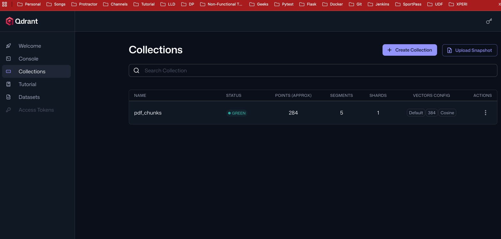

## I. Indexing Phase 

# 1.1 docker compose file to start the vector db in docker container. We are using Qdrant as vector db in this case 
# but you can use any vector db like Pinecone, Weaviate, Redis etc. Just change the vector db image and the connection details in the code accordingly.
```md
services:
  vector-db:
    image: qdrant/qdrant:latest
    container_name: vector-db
    ports:
      - "6333:6333"
```

# 1.2 Command to Start the vector db in docker containers. We are using docker compose to start the services.
```md
docker compose up -d # This will start all the services defined in the docker-compose.yml file in detached mode
```
# 1.3  vector db will be up and running on localhost:6333

# 1.4 Vector db dashboard will be available at localhost:6333/dashboard. You can use this dashboard to check the collections, documents, and embeddings stored in the vector db.


## 2. Langchain API - It is a library which gives loads of utility tools(functions) that we are going to use in day to day AI task. 
It will be running at
localhost:8000 (FastAPI app that connects to vector db and LLM)

# 2.1. Langchain document loaders - to load the data into vector db. It has different types of document loaders for different types of documents. 
We are going to use PyPDFLoader to load the PDF documents into vector db.
https://docs.langchain.com/oss/python/integrations/document_loaders/pypdfloader

# 2.1.1 Installation of langchain and PyPDFLoader to load the PDF documents into vector db
```md
pip install -qU langchain-community pypdf
```

# Initialization & loading the documents using PyPDFLoader
```python
from langchain_community.document_loaders import PyPDFLoader
loader = PyPDFLoader("path_to_pdf_file.pdf")
docs = loader.load()
print(docs[0])

```

# 2.2 Langchain Text Splitters - https://docs.langchain.com/oss/python/integrations/splitters
# To split the documents into smaller chunks before loading into vector db. 
# It has different types of text splitters for different types of documents. We are going to use RecursiveCharacterTextSplitter to split the text into smaller chunks.

# 2.2.1 Installation of TextSplitter to split the text into smaller chunks
```md
pip install -U langchain-text-splitters
```

# 2.2.2 Initialization & splitting the documents using RecursiveCharacterTextSplitter
```md
from langchain_text_splitters import RecursiveCharacterTextSplitter
text_splitter = RecursiveCharacterTextSplitter(chunk_size=1000, chunk_overlap=200)
texts = text_splitter.split_documents(docs)
print(texts[0])
```

# 3. Create vector embeddings using openAI- https://docs.langchain.com/oss/python/integrations/embeddings/openai
# To create vector embeddings from the text chunks. We are going to use OpenAIEmbeddings to create vector embeddings using OpenAI API.
# You can use any embedding model like Cohere, HuggingFace, etc. Just change the embedding model in the code accordingly.
# 3.1 Installation of OpenAIEmbeddings to create vector embeddings using OpenAI API
```md for openAI
pip install -U langchain-embeddings-openai
```
# 3.2 Initialization & creating vector embeddings using OpenAIEmbeddings
```md for openAI
from langchain_embeddings_openai import OpenAIEmbeddings
embeddings = OpenAIEmbeddings(model="text-embedding-3-small", chunk_size=1000)
vector_embeddings = embeddings.embed_documents(texts)
print(vector_embeddings[0])
```
Or

# for geminiAI 
```md for geminiAI
pip install -U langchain-google-genai
```
```md for geminiAI
from langchain_embeddings_gemini import GeminiEmbeddings
embeddings = GeminiEmbeddings(model="models/embedding-gecko-001", chunk_size=1000)
vector_embeddings = embeddings.embed_documents(texts)
print(vector_embeddings[0])
```
Or

# for hugging face embedding model (Used here, free to use and doesn't require any api key)

# use hugging face embedding model which is free to use and doesn't require any api key. You can use any hugging face embedding model of your choice. Here we are using sentence-transformers/all-MiniLM-L6-v2 model which is a good general purpose embedding model.
```md
pip install -U langchain-huggingface
```

```md this library loads huggingface specific models for creating embeddings. It is a wrapper around hugging face transformers library.
pip install sentence-transformers
```

```md
embedding_model = HuggingFaceEmbeddings(model_name="all-MiniLM-L6-v2")
```


# 3.3 Langchain Vector Stores - https://docs.langchain.com/oss/python/integrations/vectorstores/qdrant
# To store the vector embeddings into vector db. We are going to use Qdrant as vector db in this case but you can use any vector db like Pinecone, Weaviate, Redis etc. Just change the vector db in the code accordingly.

# 3.3.1 Installation of Qdrant to store the vector embeddings into vector db
```md
pip install -U langchain-qdrant
```
# 3.3.2 Initialization & storing the vector embeddings into vector db using Qdrant
```md
# | output: false
# | echo: false
from langchain_openai import OpenAIEmbeddings

embeddings = OpenAIEmbeddings(model="text-embedding-3-large")
```  

# 4. Store the vector embeddings into vector db using Qdrant
```md
from langchain_qdrant import QdrantVectorStore
vector_store = QdrantVectorStore.from_documents(documents=chunks, embedding=embeddings, url="http://localhost:6333", collection_name="pdf_chunks")
```
# 5. After this the vector embeddings will be stored in the vector db and you can use these embeddings to perform similarity search and retrieve the relevant chunks of text based on the query. 
# You can also use these embeddings to perform other tasks like clustering, classification, etc. depending on your use case.



## II. Retrieval Phase
# 6. see retrieval.py --> we would need HF API key to chat with the model. https://huggingface.co/ and signup . https://huggingface.co/settings/tokens set the token.