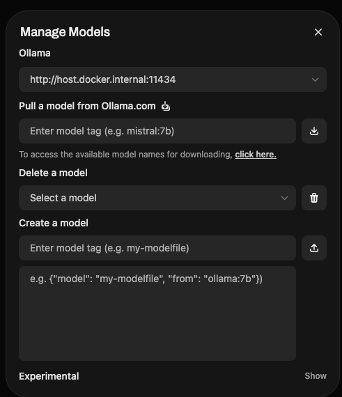

## Usecase: 
Company may want to utilize LLM model and not share company data to 3rd party. 
So they can deploy locally and use it. There are some free LLM models available.

This document will help you to deploy locally and use it.

Example Free LLM models:
1. Llama2 by Meta
2. Vicuna
3. Alpaca
4. GPT4All
5. Ollama
6. Mistral
7. Falcon
8. Claude2 by Anthropic
9. Gemini by Google
10. Qwen by Alibaba
11. Baichuan by Baidu
12. Mixtral by Mistral
13. Mistral by Mistral
14. RWKV by RWKV
15. Cerebras-GPT by Cerebras
16. RedPajama by Together
17. OpenLLaMA by OpenLLaMA
18. Koala by Koala
19. Guanaco by LMSYS

## First Approach: Using OLLAMA
## Ollama (AI platform):

Ollama provides tools to run large language models (LLMs) locally on your machine, similar to how people use OpenAI’s models via API.

It supports models like LLaMA and Alpaca, allowing you to run and interact with them without sending data to the cloud.

It’s commonly used with Docker, which makes deploying LLMs easier and isolated.

### Steps to deploy ollama and openwebui using docker
1. Install ollama in your local system

2. Pull the docker image and run 
```angular2html
docker run -d -v ollama:/root/.ollama -p 11434:11434 --name ollama ollama/ollama

```
3.It will start on localhost:11434 

4.We need OpenWebUI: OpenWebUI is a web-based user interface for interacting with local LLMs.
https://github.com/open-webui/open-webui

```angular2html
docker pull ghcr.io/open-webui/open-webui:main

docker pull ghcr.io/open-webui/open-webui:main-slim ==> for low resource system

docker run -d -p 3000:8080 -v open-webui:/app/backend/data --name open-webui ghcr.io/open-webui/open-webui:main

```
5. Now , launch openwebui on http://localhost:3000. Navigate to settings(http://localhost:3000/admin/settings/connections) and set the ollama api url as http://localhost:11434
By default it will have llama2 model. You can add more models using ollama cli commands.
6. Now, go to Admin Panels -> Models -> Add Model(download icon) it will open a pop up

7. Go to ollama.com > Models (https://ollama.com/search) to see the list of models available. 
Copy the model name and paste it in the model name field and click on Add Model. Ex: gemma3:270m(google's model) 
8. click on download icon next to it. It will download the model and add it to the list.
9. Now, you can click on new chat --> select this model and use this model to chat and generate text.


## Fast API app to use ollama api
1. Create a python virtual environment and install fastapi and uvicorn
```angular2html
python3 -m venv venv    
source venv/bin/activate
pip install fastapi uvicorn requests 
```
2.Install ollama in your local system: https://github.com/ollama/ollama pip install ollama
3.Create a file main.py and add the code to connect to LLM
4.Launch http://0.0.0.0:8000 Or http://0.0.0.0:8000/docse (swagger page) and test the api


