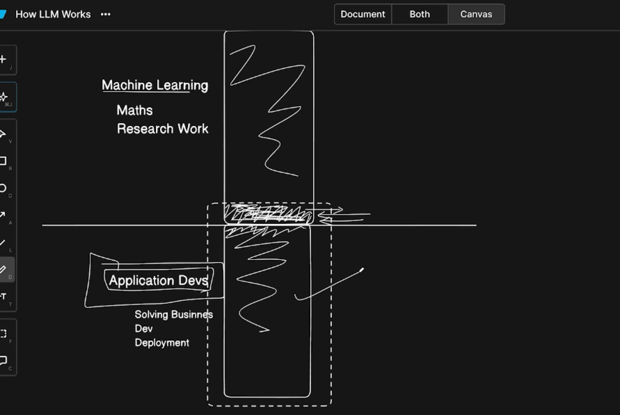
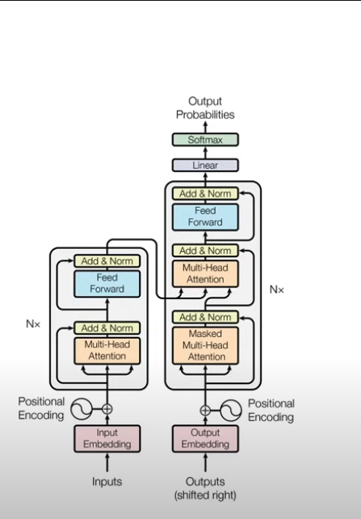

Agentic AI
========
## Normal AI: responds to prompts
1️⃣ Simple Example
Normal AI (like a basic chatbot)

You ask:
“Why did my Jenkins test fail?”

AI replies:
“Because the API returned 500.”

It only answers the question.
## Agentic AI: understands a goal and works step-by-step to complete it.
You ask:
“Fix my failing Jenkins test.”

Agentic AI might:

1. Check Jenkins logs via API
2. Detect failed test cases
3. Analyze error patterns
4. Compare with previous builds
5. Suggest the root cause
6. Open a Jira ticket
7. Post summary in Slack

So it acts autonomously to solve the problem.

AI with Python(LLM -> Large Language Model) ==> Agentic AI Journey ==> Application Development 
===========================================================
https://xperi.udemy.com/course/full-stack-ai-with-python/

GPT ==> Generative Pre-Trained Transformer. All LLM models such as Claude , gemini, chatGPT are basically GPT
Here Generative is the nature, Pre-Trained is the basis and Transformer is the model ==> GPTs are models which are pre-trained and are generative in the nature

Normal GPT flow
————————-------
INPUT TOKEN —> LLM —> Predict Next Token 

We will cover little bit of ML and more on application development. Application Developers don’t need to know in depth about ML.
ML engineers also don’t know about application developments.

ML Transformer Architecture


Architecture components explanation in brief(not needed fro app developers , mostly for ML engineers) . But good to learn basics

Step5: Passed these to neural networks which predicts the sequences

Step6: Linear - Probability matrix - It gives the sequences based on probability and assign weightage to the words/sequences and highest weightage one will be picked up
Step7: output

https://tiktokenizer.vercel.app/  ==> Tiktokenizer

https://www.youtube.com/watch?v=bCz4OMemCcA ==> Google Whitepaper on Transformers Architecture

https://projector.tensorflow.org/ ==> Vector Embedding 3D

Building AI Agent[	Agents, which are LLMs equipped with instructions and tools]

=============

Open AI[CHARGEABLE]
————————————

https://openai.github.io/openai-agents-python/ ==> docs

https://platform.openai.com/docs/overview ==> Create an account

https://platform.openai.com/settings/organization/api-keys ==> Create API Key

https://platform.openai.com/settings/organization/usage

https://platform.openai.com/settings/organization/billing/overview ==> To use openAI platform for development purposes, minuiimum 5$ should be added.

https://platform.openai.com/settings/organization/limits
https://www.youtube.com/watch?v=CI3wHdLJb_c ==> openAI vs chatGPT

API Key: You need API key to work

Gemini from Google[FREE]
——————————————

https://aistudio.google.com/api-keys ==> Create API key

https://ai.google.dev/gemini-api/docs ==> docs

Gemini AI Using OpenAI python libs[FREE]
—————————————————————————

OpenAI SDK supports generative AI by Google:  https://ai.google.dev/gemini-api/docs/openai

Problem statement :  we have 2 different syntax for openAI and gemeni-ai in python. openAI supports using geminiAI through its library. So, using openAI libs we can use openAI and geminiAI as well

gemini openai compatible api: 

